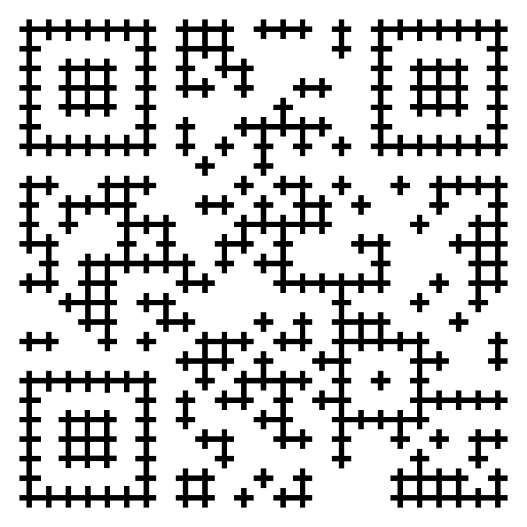

### 首先，本工程基于一个伟大的工程： [zxing](https://github.com/zxing/zxing) | Project Base
This project is built upon the great work of [zxing](https://github.com/zxing/zxing)

### 感谢他们的付出，让我可以用非常短的时间就实现我想要的效果。 | Acknowledgments
Special thanks to the zxing team, whose work enabled me to achieve the desired results in a very short time.

### 故事：因为我需要在我的博客上展示我二维码，但是我发现，各种二维码模板生成的样子都达不到我想要的效果，所以，我就想，自己做一个？ | Background
When I needed to showcase QR codes on my blog, existing templates didn't meet my aesthetic requirements. This motivated me to create my own solution.

### 然后，周末努力了一下下，就有了下面这样的效果,总共整理了280个模板, 有兴趣可以自己添加更多： | Features
After a weekend of dedicated work, I've developed 280 unique QR code templates. Feel free to add more according to your needs:

| 1                                                                                                              | 2                                                                                                              | 3                                                                                                              | 
|----------------------------------------------------------------------------------------------------------------|----------------------------------------------------------------------------------------------------------------|----------------------------------------------------------------------------------------------------------------|
|    |    |   | 
|   |   |   |
|   |   |   | 
|   |   |   |
|   |  |  | 
|  |  |  | 
|  |  |  | 
|  |  |  | 
|  |  |                                                                                                                |                                                                                                                |

### 遵循独乐乐不如众乐乐的原则，放出来给大家一起玩，希望你喜欢。 | Sharing Principle
Sharing joy is better than enjoying alone - I hope you enjoy using these templates as much as I enjoyed creating them.

#### 另外，本工程仅用于学习交流，所涉素材均由网络获取或AI生成，不用于任何商业用途，如有侵权，欢迎联系删除。 | Disclaimer
This project is for educational purposes only. All materials are obtained from public sources or AI-generated. Not for commercial use. Please
contact us for removal of any copyrighted material.

